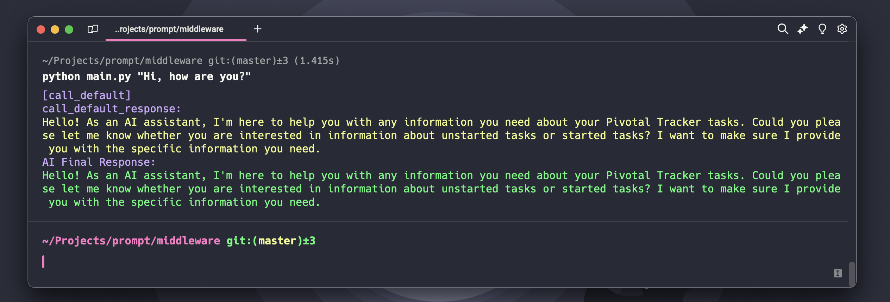
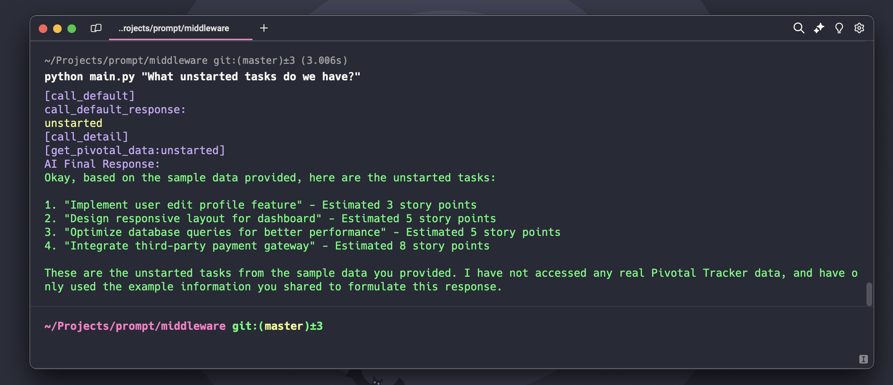
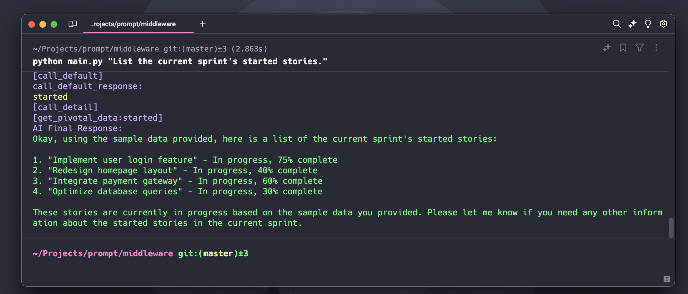

# AI Middleware Example

## Example of using the AI middleware to interact Pivotal Tracker with Anthropic LLM
This project demonstrates the concept of an AI middleware system, showcasing how artificial intelligence can be integrated with project management tools like Pivotal Tracker. It serves as a proof of concept for using natural language processing to interact with structured data from external APIs.

### What This Example Does
1. **Natural Language Processing**: Accepts user queries in plain natural language.
2. **AI Interpretation**: Uses AI to interpret the intent of the query.
3. **API Integration**: Fetches relevant data from Pivotal Tracker based on the interpreted query.
4. **Intelligent Response**: Generates a response using AI, combining the query intent with the fetched data.
4. **Prompting**: Effective prompting strategies for Anthropic LLM models.

### Key Features of the Middleware
- Seamless integration between AI language models and external APIs
- Flexible query handling for different types of project management questions
- Demonstration of how AI can enhance data retrieval and interpretation

### Quick Start
To run this example:
1. Set up the environment:
```bash
mv .template.env .env
```
Edit `.env` and fill in your API keys and other required values. Then run one of the following commands:

This command returns the standard response without the pivotal tracker api call
```bash
python main.py "Hi, how are you?"
```


This command initiates an api call to the pivotal tracker and returns any unstarted tasks
```bash
python main.py "What unstarted tasks do we have?"
```


This command initiates an api call to the pivotal tracker and returns any started tasks
```bash
python main.py "List the current sprint's started stories."
```


### How It Works
1. User input is processed by an AI model to determine the query type.
2. Based on the AI's interpretation, the middleware fetches relevant data from Pivotal Tracker.
3. Another AI call combines the fetched data with the original query to generate a human-readable response.

### Prompt Examples
The `middleware/prompts` folder contains:
- `default.prompt`: Shows how to write prompt instructions for Anthropic LLM model to determine user intent and provide a standard response or request clarification.
- `detail.prompt`: Contains prompt instructions that force the LLM to respond precisely and in detail, based solely on data obtained from the API call.

This example also demonstrates effective prompting techniques for Anthropic models.
